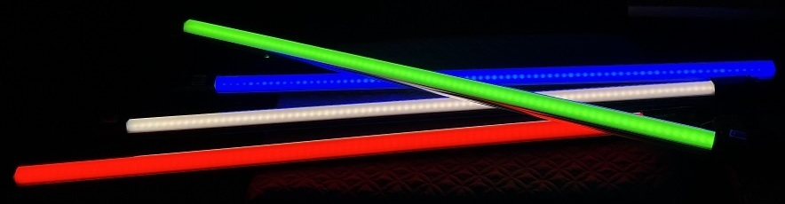
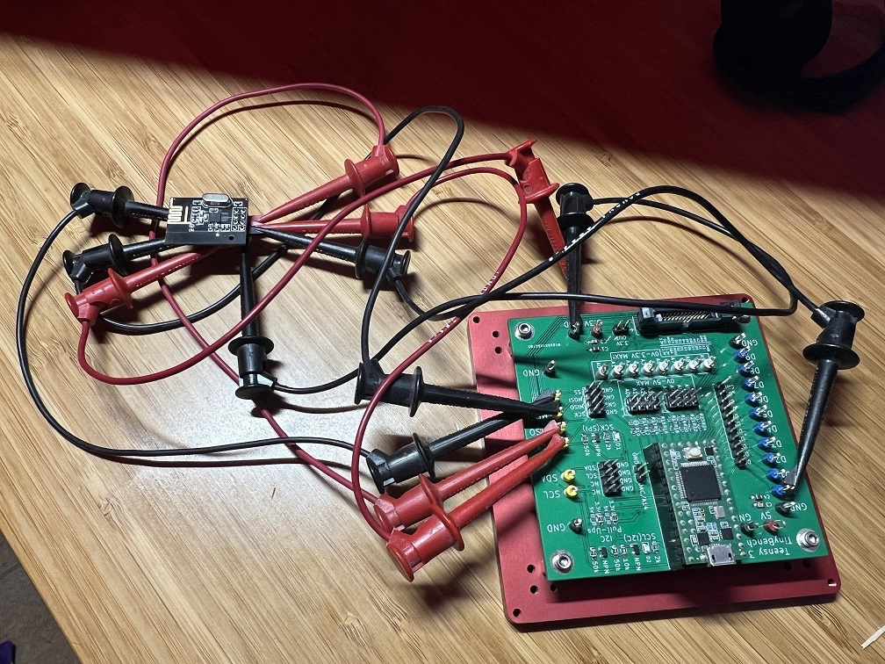
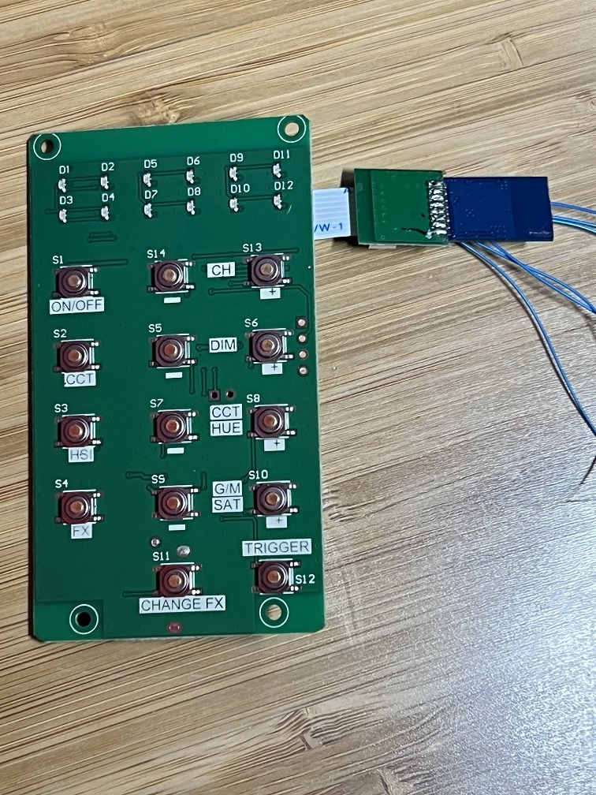
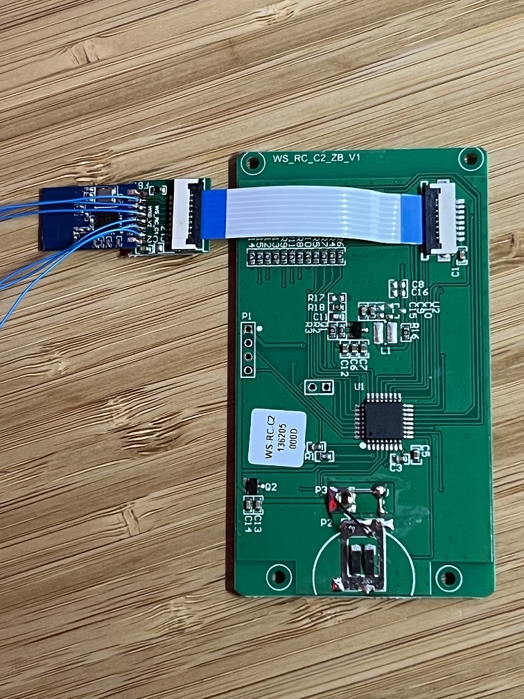
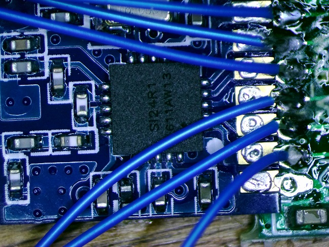
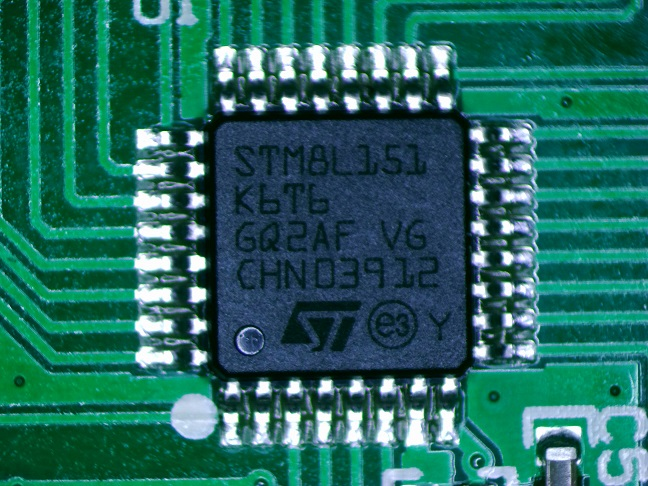
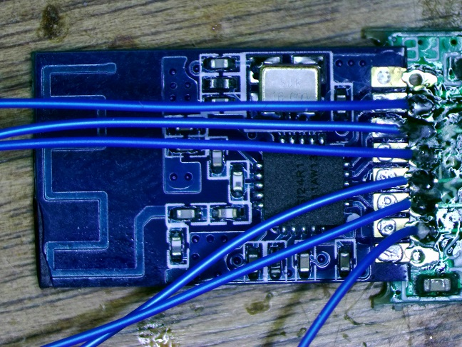

# PavoTube 2.4GHz RF Link Reverse Engineering

 

This is the results of my hacking the Nanlite PavoTube II 30C RGB LED Tube and Nanlink WSRCC2 remote control to develop my own hardware to control the PavoTube from custom hardware.

# Demo Hardware
The demo sketch was loaded onto a Teensy 3.2 which was wired to an NRF24L01+ module. 

Teensy 3.2  <--> NRF24L01+ module 
&nbsp;&nbsp;&nbsp;&nbsp;  3.3V <--> VCC 
&nbsp;&nbsp;&nbsp;&nbsp;  GND  <--> GND 
&nbsp;&nbsp;&nbsp;&nbsp;  SCLK <--> SCL 
&nbsp;&nbsp;&nbsp;&nbsp;  MOSI <--> MOSI 
&nbsp;&nbsp;&nbsp;&nbsp;  MISO <--> MISO 
&nbsp;&nbsp;&nbsp;&nbsp;  D10  <--> /CS 
&nbsp;&nbsp;&nbsp;&nbsp;  D0   <--> CE 
&nbsp;&nbsp;&nbsp;&nbsp;  N/C  <--> IRQ 
 
 

# Demo Software
These sketch was developed on a Teensy 3.2 using the Arduino IDE plugins. It should work on a Nano, Uno, etc. 
[Demo Sketch](pavotube_demo_sketch/pavotube_demo_sketch.ino) 
[Police Lights Sketch](police_lights_effect/police_lights_effect.ino) 
[Fast Effects Sketch](fastest_effects/fastest_effects.ino)

# High Speed Effects
Using slow-mo video on my iPhone 13 Pro I can verify that I get good color rendition down to 5ms on-time. This is much faster than my brain can process it; high-speed effects are possible.

# Pavotube Configuration
The Pavotube address was set to 12. Any address can be used, just update the *ADDR* values in the NRF24L01+ configuration commands.

# Transceiver Configuration

The Nanlink WSRCC2 remote was used to glean insight into the protocol. The remote uses the SI24R1 knock-off of the Nordic NRF24L01+ as an RF transceiver. It's controlled by an STM8L151 microcontroller. The RFIC is on a castellated via module, connected to the main PCB via a flex cable. 

The SI24R1 is configured as follows:
- TX_ADDR = 12 
- RX_ADDR_P0 = 12 
- ENAA_P0 = 1 (enable auto ACK on data pipe 0) 
- ERX_P0 = 1 (enable RX data pipe 0) 
- SETUP_RETR = 0x1f (15 retransmits, 200us delay) 
- RF_CH = 0x73 (2515MHz) 
- RF_SETUP = 6 (output power = 0dBm) 
- CONFIG = 0xE (enable CRC, CRC is 2 bytes, POWER_UP) 
- Other register values set to defaults 

# SPI Bus Sniffing

The SPI bus and SI24R1 CE pin signals were sniffed by soldering wires onto the castellated vias on the RF module, then captured using a Saleae logic analyzer. The captures were saved and can be viewed using Saleae's Logic software.

The remote control first sends commands over 2460MHz, which are not acknowledged by the Pavotube and don't appear to accomplish anything. These may be for other lights with a different protocol.

The remote then configures the SI24R1 for 2515MHz, sends a series of bytes which are acknowledged by the Pavotube but do not seem to do anything. These may be for other lights with a different protocol.

It then sends the command which updates the Pavotube. The command is sent using W_TX_PAYLOAD followed by 4 bytes:

&nbsp;&nbsp;&nbsp;&nbsp;  CCT Mode: INTENSITY, COLORTEMP, (INTENSITY + COLORTEMP), 255 - (INTENSITY + COLORTEMP) 
&nbsp;&nbsp;&nbsp;&nbsp;&nbsp;&nbsp;&nbsp;&nbsp;    INTENSITY = [0 100] 
&nbsp;&nbsp;&nbsp;&nbsp;&nbsp;&nbsp;&nbsp;&nbsp;    COLORTEMP = [0 100] 

&nbsp;&nbsp;&nbsp;&nbsp;  HSI Mode: COLORBAND, INTENSITY, HUE, SATURATION 
&nbsp;&nbsp;&nbsp;&nbsp;&nbsp;&nbsp;&nbsp;&nbsp;    COLORBAND = 240 OR 241 
&nbsp;&nbsp;&nbsp;&nbsp;&nbsp;&nbsp;&nbsp;&nbsp;    INTENSITY = [0 100] 
&nbsp;&nbsp;&nbsp;&nbsp;&nbsp;&nbsp;&nbsp;&nbsp;    HUE = [0 255] if COLORBAND == 240, [0 to 104] if COLORBAND == 241 
&nbsp;&nbsp;&nbsp;&nbsp;&nbsp;&nbsp;&nbsp;&nbsp;    SATURATION = [0 100] 
 
&nbsp;&nbsp;&nbsp;&nbsp;  Example HSI Colors: 
&nbsp;&nbsp;&nbsp;&nbsp;&nbsp;&nbsp;&nbsp;&nbsp;    YELLOW:  {240, 100, 33, 100} 
&nbsp;&nbsp;&nbsp;&nbsp;&nbsp;&nbsp;&nbsp;&nbsp;    GREEN: 	 {240, 100, 83, 100} 
&nbsp;&nbsp;&nbsp;&nbsp;&nbsp;&nbsp;&nbsp;&nbsp;    BLUE: 	 {240, 100, 240, 100} 
&nbsp;&nbsp;&nbsp;&nbsp;&nbsp;&nbsp;&nbsp;&nbsp;    MAGENTA: {241, 100, 79, 100} 
&nbsp;&nbsp;&nbsp;&nbsp;&nbsp;&nbsp;&nbsp;&nbsp;    RED: 	 {241, 100, 104, 100} 

## PNG images of SPI bus sniffing:

### CCT mode, max brightness, max color temperature:
[Protocol image with notations](spi_captures/CCT_max_brightness_max_colortemp_overview.png) 
[Zoomed into command group 1](spi_captures/CCT_max_brightness_max_colortemp_cmd1.png) 
[Zoomed into command group 2](spi_captures/CCT_max_brightness_max_colortemp_cmd2.png) 
[Zoomed into command group 3a](spi_captures/CCT_max_brightness_max_colortemp_cmd3a.png) 
[Zoomed into command group 3b](spi_captures/CCT_max_brightness_max_colortemp_cmd3b.png) 
[Zoomed into command group 4](spi_captures/CCT_max_brightness_max_colortemp_cmd4.png) 
[Zoomed into command group 5](spi_captures/CCT_max_brightness_max_colortemp_cmd5.png) 
[Zoomed into command group 6](spi_captures/CCT_max_brightness_max_colortemp_cmd6.png) 

### CCT mode, min brightness, max color temperature:
[Zoomed into CCT set command](spi_captures/CCT_min_brightness_max_colortemp_cmd.png)

### CCT, HSI, FX buttons:
The CCT and HSI buttons on the remote do cause the Pavotube to change between CCT and HSI modes. The RF payloads are not acknowledged however. I didn't dig into this further as I have no interest in switching tube modes in that way. The tube changes modes automatically when the corresponding HSI or CCT color/intensity/hue command is sent.

The FX button sends commands on the 2460MHz channel but doesn't have any noticeable effect on the Pavotube.

## Saleae captures
These can be loaded into Saleae Logic to be viewed in detail: 
[CCT Max Brightness Max Colortemp](spi_captures/CCT_max_brightness_max_colortemp.sal) 
[CCT Max Brightness Min Colortemp](spi_captures/CCT_max_brightness_min_colortemp.sal) 
[CCT Min Brightness Max Colortemp](spi_captures/CCT_min_brightness_max_colortemp.sal) 
[CCT Min Brightness Min Colortemp](spi_captures/CCT_min_brightness_min_colortemp.sal) 
[HSI Max Brightness, Max Saturation, Blue](spi_captures/HSI_max_bright_max_sat_color_blue.sal) 
[HSI Max Brightness, Max Saturation, Red](spi_captures/HSI_max_bright_max_sat_color_red.sal) 
[HSI Max Brightness, Max Saturation, Yellow](spi_captures/HSI_max_bright_max_sat_color_yellow.sal) 
[HSI Max Brightness, Min Saturation, Magenta](spi_captures/HSI_max_bright_min_sat_color_magenta.sal) 
[CCT Button Press](spi_captures/CCT_Button_Press.sal) 
[HSI Button Press](spi_captures/HSI_button_press.sal) 

## Nanlink Remote Photos
 
 
 
 
 

## Versioning

I am not discplined about versioning, let's call this 1.0

## License

Public domain
